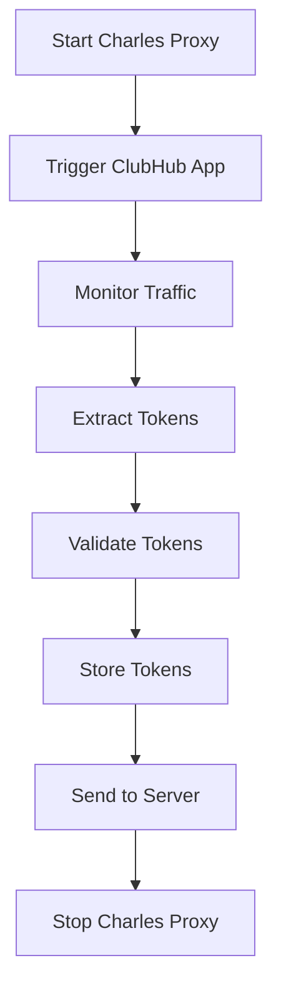

# ClubHub Token Capture Automation System

## 🎯 Overview

The ClubHub Token Capture Automation System is a sophisticated solution for automatically extracting, validating, and managing ClubHub API authentication tokens from an iPad using Charles Proxy. This system eliminates the need for manual token retrieval and provides a secure, repeatable, and resilient approach to ClubHub API access.

## 🏗️ System Architecture

```
┌─────────────────┐    ┌─────────────────┐    ┌─────────────────┐
│   iPad with     │    │  Charles Proxy  │    │  Python Bot     │
│  ClubHub App    │───▶│  (Headless)     │───▶│  (Token Capture)│
└─────────────────┘    └─────────────────┘    └─────────────────┘
                                │                        │
                                ▼                        ▼
                       ┌─────────────────┐    ┌─────────────────┐
                       │  Session Files  │    │  Flask Server   │
                       │  (CHLS Format)  │    │  (Token Storage)│
                       └─────────────────┘    └─────────────────┘
```

## 🚀 Key Features

### **1. Automated Token Extraction**
- **Charles Proxy Integration**: Monitors iPad ClubHub app traffic in headless mode
- **Pattern Recognition**: Extracts bearer tokens, session cookies, and authorization headers
- **Smart Parsing**: Handles various token formats and response structures
- **Error Recovery**: Graceful handling of extraction failures

### **2. Token Validation & Management**
- **API Validation**: Tests extracted tokens against ClubHub API
- **Secure Storage**: Encrypted local storage with timestamp tracking
- **Expiry Management**: Automatic detection of expired tokens
- **History Tracking**: Maintains extraction history for debugging

### **3. Flask API Server**
- **RESTful Endpoints**: Complete API for token management
- **Token Submission**: Receive tokens from automation system
- **Token Retrieval**: Get latest valid tokens via API
- **Validation Endpoints**: Test token validity against ClubHub API
- **History API**: Access token extraction history

### **4. Scheduled Automation**
- **Automated Execution**: Runs token extraction every 23 hours
- **Scheduled Triggers**: Daily extraction at 6 AM
- **Background Processing**: Non-blocking server operation
- **Status Monitoring**: Real-time workflow status tracking

## 📋 Prerequisites

### **Hardware Requirements**
- **Mac Computer**: Running macOS (for Charles Proxy)
- **iPad**: With ClubHub app installed
- **Network**: Both devices on same network

### **Software Requirements**
- **Charles Proxy**: Professional or trial version
- **Python 3.8+**: With required packages
- **Flask**: Web framework for API server
- **Schedule**: For automated execution

### **Network Setup**
- **iPad IP Address**: Static IP recommended
- **Charles Proxy**: Configured as system proxy
- **SSL Certificate**: Installed on iPad for HTTPS inspection

## 🔧 Installation & Setup

### **Step 1: Install Dependencies**

```bash
# Install Python packages
pip install flask flask-cors schedule requests

# Install Charles Proxy (if not already installed)
# Download from: https://www.charlesproxy.com/
```

### **Step 2: Configure Charles Proxy**

1. **Install Charles Proxy** on your Mac
2. **Configure SSL Certificate**:
   - Help → SSL Proxying → Install Charles Root Certificate
   - Install certificate on iPad
3. **Set up Proxy Settings**:
   - Configure iPad to use Mac as proxy
   - Enable SSL proxying for ClubHub domain

### **Step 3: Configure System**

```python
# Update configuration in automated_token_workflow.py
charles_config = {
    "charles_path": "/Applications/Charles.app/Contents/MacOS/Charles",
    "ipad_ip": "192.168.1.100",  # Your iPad IP address
    "clubhub_domain": "clubhub-ios-api.anytimefitness.com"
}

server_config = {
    "host": "0.0.0.0",
    "port": 5000,
    "token_storage_path": "data/token_server"
}
```

### **Step 4: Test Initial Setup**

```python
from gym_bot.services.authentication.automated_token_workflow import run_single_extraction

# Run single extraction to test system
results = run_single_extraction()
print(f"Extraction successful: {results['success']}")
```

## 🎮 Usage

### **Manual Token Extraction**

```python
from gym_bot.services.authentication.clubhub_token_capture import ClubHubTokenCapture

# Initialize token capture
capture = ClubHubTokenCapture()

# Extract fresh tokens
tokens = capture.extract_fresh_tokens()

if tokens:
    print("✅ Tokens extracted successfully")
    print(f"Bearer Token: {tokens.get('bearer_token', 'Not found')}")
else:
    print("❌ Token extraction failed")
```

### **Automated Workflow**

```python
from gym_bot.services.authentication.automated_token_workflow import run_automated_workflow

# Run complete automated system
run_automated_workflow()
```

### **Flask Server API**

```python
# Start token server
from gym_bot.services.authentication.token_server import run_token_server
run_token_server(host="0.0.0.0", port=5000)

# API Endpoints:
# GET  /health              - Health check
# POST /tokens              - Submit tokens
# GET  /tokens/latest       - Get latest tokens
# POST /tokens/validate     - Validate tokens
# POST /tokens/refresh      - Trigger refresh
# GET  /tokens/history      - Get extraction history
```

## 🔄 Workflow Process

### **1. Token Extraction Process**



### **2. Scheduled Execution**

- **Every 23 Hours**: Automatic token extraction
- **Daily at 6 AM**: Scheduled extraction
- **On Demand**: Manual extraction via API
- **Error Recovery**: Automatic retry on failure

### **3. Token Lifecycle**

1. **Extraction**: Charles Proxy captures ClubHub app traffic
2. **Parsing**: System extracts bearer tokens and session cookies
3. **Validation**: Tokens tested against ClubHub API
4. **Storage**: Valid tokens stored securely with metadata
5. **Distribution**: Tokens sent to Flask server for access
6. **Expiry**: Automatic detection and refresh of expired tokens

## 🔒 Security Features

### **Token Security**
- **Encrypted Storage**: Tokens stored with encryption
- **Access Control**: API endpoints with validation
- **Expiry Management**: Automatic token refresh
- **Audit Trail**: Complete extraction history

### **Network Security**
- **HTTPS Inspection**: Secure SSL certificate handling
- **Proxy Authentication**: Charles Proxy security
- **API Security**: Flask server with CORS protection

### **Data Protection**
- **Local Storage**: Tokens stored locally, not in cloud
- **Metadata Tracking**: Extraction timestamps and sources
- **Error Logging**: Comprehensive error tracking
- **Cleanup**: Automatic removal of old tokens

## 🛠️ Configuration Options

### **Charles Proxy Configuration**

```python
charles_config = {
    "charles_path": "/Applications/Charles.app/Contents/MacOS/Charles",
    "charles_port": 8888,
    "charles_ssl_port": 8889,
    "session_file": "charles_session.chls",
    "log_file": "charles_log.txt",
    "ipad_ip": "192.168.1.100",
    "clubhub_domain": "clubhub-ios-api.anytimefitness.com",
    "token_patterns": {
        "bearer_token": r'Bearer\s+([A-Za-z0-9\-._~+/]+=*)',
        "session_cookie": r'incap_ses_\d+_\d+=([^;]+)',
        "authorization_header": r'Authorization:\s*Bearer\s+([A-Za-z0-9\-._~+/]+=*)'
    }
}
```

### **Server Configuration**

```python
server_config = {
    "token_storage_path": "data/token_server",
    "host": "0.0.0.0",
    "port": 5000,
    "debug": False,
    "token_expiry_hours": 24,
    "max_stored_tokens": 50
}
```

### **Workflow Configuration**

```python
workflow_config = {
    "extraction_interval_hours": 23,
    "server_port": 5000,
    "server_host": "0.0.0.0",
    "token_expiry_threshold": timedelta(hours=23)
}
```

## 📊 Monitoring & Logging

### **Log Files**
- `logs/clubhub_token_capture.log`: Token extraction logs
- `logs/token_server.log`: Flask server logs
- `logs/automated_token_workflow.log`: Workflow logs

### **Status Monitoring**

```python
from gym_bot.services.authentication.automated_token_workflow import create_automated_workflow

workflow = create_automated_workflow()
status = workflow.get_workflow_status()

print(f"Server Status: {status['server_status']}")
print(f"Latest Tokens Available: {status['latest_tokens_available']}")
print(f"Next Scheduled Run: {status['next_scheduled_run']}")
```

### **API Monitoring**

```bash
# Check server health
curl http://localhost:5000/health

# Get latest tokens
curl http://localhost:5000/tokens/latest

# Get extraction history
curl http://localhost:5000/tokens/history
```

## 🔧 Troubleshooting

### **Common Issues**

1. **Charles Proxy Not Starting**
   - Check Charles installation path
   - Verify Charles license/registration
   - Check for conflicting processes

2. **Token Extraction Fails**
   - Verify iPad network connectivity
   - Check SSL certificate installation
   - Ensure ClubHub app is active

3. **Token Validation Fails**
   - Check token format and completeness
   - Verify ClubHub API accessibility
   - Check network connectivity

4. **Server Connection Issues**
   - Verify server port availability
   - Check firewall settings
   - Ensure CORS configuration

### **Debug Mode**

```python
# Enable debug logging
import logging
logging.basicConfig(level=logging.DEBUG)

# Run with debug output
from gym_bot.services.authentication.clubhub_token_capture import ClubHubTokenCapture
capture = ClubHubTokenCapture()
capture.logger.setLevel(logging.DEBUG)
tokens = capture.extract_fresh_tokens()
```

## 🚀 Production Deployment

### **Systemd Service (Linux)**

```ini
[Unit]
Description=ClubHub Token Capture Service
After=network.target

[Service]
Type=simple
User=your-user
WorkingDirectory=/path/to/gym-bot
ExecStart=/usr/bin/python3 -m gym_bot.services.authentication.automated_token_workflow
Restart=always
RestartSec=10

[Install]
WantedBy=multi-user.target
```

### **Launchd Service (macOS)**

```xml
<?xml version="1.0" encoding="UTF-8"?>
<!DOCTYPE plist PUBLIC "-//Apple//DTD PLIST 1.0//EN" "http://www.apple.com/DTDs/PropertyList-1.0.dtd">
<plist version="1.0">
<dict>
    <key>Label</key>
    <string>com.gymbot.token-capture</string>
    <key>ProgramArguments</key>
    <array>
        <string>/usr/bin/python3</string>
        <string>-m</string>
        <string>gym_bot.services.authentication.automated_token_workflow</string>
    </array>
    <key>RunAtLoad</key>
    <true/>
    <key>KeepAlive</key>
    <true/>
    <key>StandardOutPath</key>
    <string>/var/log/gymbot-token-capture.log</string>
    <key>StandardErrorPath</key>
    <string>/var/log/gymbot-token-capture.error.log</string>
</dict>
</plist>
```

## 📈 Performance Optimization

### **Resource Usage**
- **Memory**: ~50MB for token capture system
- **CPU**: Minimal usage during idle, spikes during extraction
- **Network**: Low bandwidth usage for API calls
- **Storage**: ~1MB per token extraction

### **Optimization Tips**
- **Scheduled Extraction**: Run during low-usage hours
- **Token Caching**: Cache valid tokens to reduce API calls
- **Log Rotation**: Implement log file rotation
- **Error Recovery**: Implement exponential backoff for retries

## 🔮 Future Enhancements

### **Planned Features**
- **Multi-iPad Support**: Handle multiple iPad devices
- **Cloud Integration**: Store tokens in Google Cloud Secret Manager
- **Advanced Monitoring**: Web dashboard for system status
- **Machine Learning**: Predict token expiry patterns

### **Integration Opportunities**
- **ClubHub API Service**: Direct integration with existing services
- **Multi-Channel Notifications**: Alert on token extraction failures
- **Advanced Data Management**: Token analytics and reporting

## 📞 Support

For issues or questions:
1. Check the troubleshooting section above
2. Review log files for error details
3. Test individual components separately
4. Verify network and SSL certificate setup

---

**Note**: This system requires Charles Proxy and proper SSL certificate setup. Ensure compliance with ClubHub's terms of service and applicable privacy regulations. 